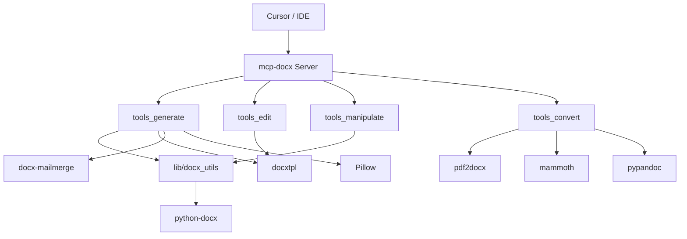
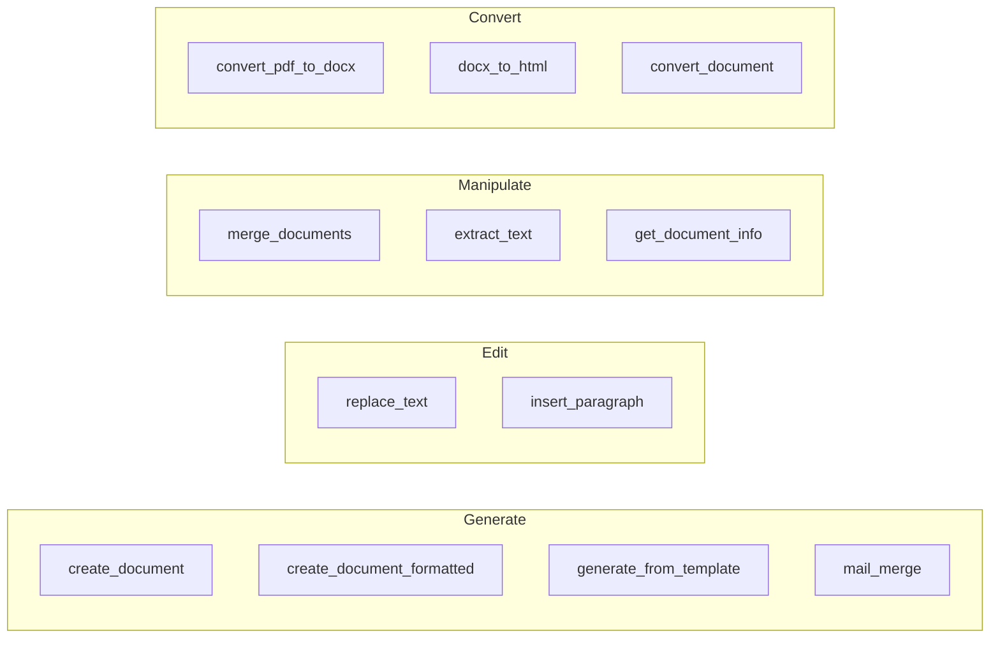
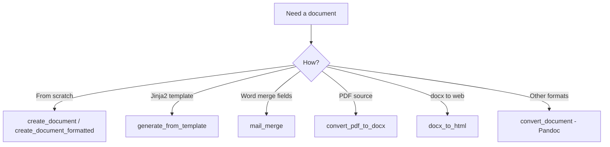

# mcp-docx

MCP (Model Context Protocol) server for Word documents: generate, edit, and manipulate `.docx` files from Cursor, Claude, or any MCP client. Implemented in Python.

## Features

- **Generate** documents from templates (Jinja2 placeholders `{{ name }}`, `{{ date }}`) or create new documents from scratch; **mail merge** for Word merge fields (`«Nome»`, `«Data»`)
- **Edit** existing documents: replace placeholders, insert paragraphs
- **Manipulate** documents: merge multiple files, extract plain text, get metadata (paragraph count, word count)
- **Format** rich documents with titles, headings, bullet lists, and **images** (optional extra)
- **Convert** PDF to .docx, .docx to HTML, and other formats via Pandoc (optional extras)

## Requirements

- Python 3.10+
- pip or uv

## Installation

```bash
git clone https://github.com/AndersonTaborga/mcp-docx.git
cd mcp-docx
pip install -e .
```

Or with uv:

```bash
uv pip install -e .
```

## Cursor configuration

Add the MCP server in **Cursor Settings → MCP** or edit the config file directly:

- **Windows:** `%USERPROFILE%\.cursor\mcp.json`
- **macOS / Linux:** `~/.cursor/mcp.json`

Example (run from project root; use your actual project path for `cwd`):

```json
{
  "mcpServers": {
    "mcp-docx": {
      "command": "python",
      "args": ["-m", "mcp_docx.server"],
      "cwd": "C:/path/to/mcp-docx-python"
    }
  }
}
```

You **must** set `cwd` to the project root (where `pyproject.toml` and `src/` live) so the `mcp_docx` module can be loaded.

Alternatively, after `pip install -e .`, you can use the installed script (still set `cwd` to the project if needed):

```json
{
  "mcpServers": {
    "mcp-docx": {
      "command": "mcp-docx",
      "cwd": "C:/path/to/mcp-docx-python"
    }
  }
}
```

If Cursor does not find `python` in PATH, use the full path to your Python executable (e.g. `C:/Users/You/AppData/Local/Programs/Python/Python310/python.exe` on Windows).

## Tools

All tools accept paths to `.docx` (or other formats where noted) on the filesystem accessible by the server process.

| Tool | Description |
|------|-------------|
| `create_document` | Create a new .docx from scratch with a title and list of paragraphs. |
| `create_document_formatted` | Create a well-formatted .docx with title, subtitle, headings (level 1–2), paragraphs, bullet lists, and optional images (`image` block; requires `[images]`). |
| `generate_from_template` | Generate a .docx from a template and a JSON object. Template uses Jinja2: `{{ name }}`, `{{ date }}`. |
| `mail_merge` | Fill Word mail-merge fields in a .docx template (e.g. `«Nome»`, `«Data»`). Requires `[mailmerge]`. |
| `replace_text` | Replace placeholders in an existing .docx (Jinja2) and save to a new file. |
| `insert_paragraph` | Insert a paragraph at the end of an existing .docx and save to a new file. |
| `merge_documents` | Merge multiple .docx files into one (uses the first file's styles). |
| `extract_text` | Extract plain text from a .docx file. |
| `get_document_info` | Get basic metadata: paragraph count, word count, and a short text preview. |
| `convert_pdf_to_docx` | Convert a PDF file to .docx. Requires `[pdf]`. |
| `docx_to_html` | Convert a .docx file to HTML. Returns `html` and `messages`. Requires `[html]`. |
| `convert_document` | Convert a document to another format using Pandoc (e.g. docx, html, md). Requires `[pandoc]` and Pandoc on PATH. |

### Optional features

Some tools require optional dependencies. Install them with:

```bash
pip install mcp-docx[pdf,html,images,mailmerge]
# or install everything including Pandoc support:
pip install mcp-docx[all]
```

| Extra | Libs installed | Tools enabled |
|-------|----------------|----------------|
| `images` | Pillow | `image` block in `create_document_formatted` |
| `pdf` | pdf2docx | `convert_pdf_to_docx` |
| `html` | mammoth | `docx_to_html` |
| `mailmerge` | docx-mailmerge | `mail_merge` |
| `pandoc` | pypandoc | `convert_document` (Pandoc binary must be on PATH) |

Without the corresponding extra, the tool returns an error message instructing you to install it (e.g. `pip install mcp-docx[pdf]`).

### Example: generate_from_template

- **templatePath**: Path to a `.docx` template with e.g. `Hello {{ name }}, date: {{ date }}`.
- **outputPath**: Where to write the generated file.
- **data**: `{ "name": "World", "date": "2025-01-01" }`.

### Example: create_document

- **outputPath**: Path for the output file.
- **title**: Document title.
- **paragraphs**: Array of strings, e.g. `["First paragraph.", "Second paragraph."]`.

### Example: create_document_formatted

- **outputPath**: Path for the output file.
- **content_blocks**: Array of objects. Each object has **type** and:
  - `{"type": "heading", "level": 1 or 2, "text": "Section title"}`
  - `{"type": "paragraph", "text": "Body text."}`
  - `{"type": "list_bullet", "items": ["Item one.", "Item two."]}`
  - `{"type": "image", "path": "/path/to/image.png", "width_inches": 2.0}` (requires `[images]`)
- **title** (optional): Centered document title.
- **subtitle** (optional): Centered subtitle.
- **font_name** (optional): Default font, e.g. `"Calibri"`.
- **font_size_pt** (optional): Default font size, e.g. `11`.

### Example: mail_merge

- **templatePath**: Path to a .docx with Word merge fields (e.g. `«Nome»`, `«Data»`).
- **outputPath**: Where to write the filled document.
- **merge_data**: `{ "Nome": "João", "Data": "2025-01-15" }`. Returns `{ "outputPath": "...", "message": "..." }`.

### Example: convert_pdf_to_docx

- **pdf_path**: Path to the PDF file.
- **output_path**: Path for the output .docx. Returns `{ "outputPath": "...", "message": "..." }`.

### Example: docx_to_html

- **document_path**: Path to the .docx file. Returns `{ "html": "<p>...</p>", "messages": [] }`.

### Example: convert_document

- **input_path**: Path to the source file.
- **output_path**: Path for the output file.
- **output_format**: e.g. `"docx"`, `"html"`, `"md"`. Returns `{ "outputPath": "...", "message": "..." }`.

### Example: extract_text

- **documentPath**: Path to the `.docx` file. Returns `{ "text": "..." }`.

## Architecture and workflows

### Stack (architecture)



### Tool categories



### Flow: generate vs convert



## Compatibility

Output is standard Office Open XML (OOXML) and is compatible with Microsoft Word and other applications that support `.docx`. Templates are best created and formatted in Word for best fidelity.

## Text encoding

All text inputs are expected to be **Unicode (UTF-8)**. The server normalizes text to Unicode NFC before writing, so Portuguese and other accented characters are stored correctly.

## Agent Skills

This repository includes **Agent Skills** (SKILL.md) in [.cursor/skills/](.cursor/skills/) so that Cursor’s agent uses the mcp-docx MCP with better formatting, generation, and fluency. When you open this project in Cursor, the agent can load these skills automatically (from `.cursor/skills/` or `.agents/skills/`).

| Skill | Description |
|-------|-------------|
| **mcp-docx-quick-reference** | One-page reference: tool names, parameters, and content_blocks format. |
| **mcp-docx-formatting** | Use create_document_formatted with headings, paragraphs, and bullet lists for professional layout. |
| **mcp-docx-simple-vs-formatted** | When to use create_document vs create_document_formatted. |
| **mcp-docx-fluency** | Map natural-language requests to the right mcp-docx tool and parameters. |
| **mcp-docx-document-structures** | Ready-made structures: meeting minutes, report, presentation script, checklist. |
| **mcp-docx-templates** | Use generate_from_template and replace_text for template-based generation. |
| **mcp-docx-merge-extract** | Use merge_documents, extract_text, and get_document_info. |
| **mcp-docx-encoding** | UTF-8 and NFC normalization; avoid mojibake in generated documents. |

Skills follow the [Agent Skills](https://agentskills.io/specification) format. They do not change the MCP server; they guide the agent on when and how to call the tools.

## Contributing

See [CONTRIBUTING.md](CONTRIBUTING.md). Development is done on the `dev` branch; `main` is for production releases.

## Testing the MCP

After installing and configuring the server in Cursor, you can ask the AI to use the **create_document** tool (or any other tool) to generate a `.docx` in a folder of your choice. Example: *"Create a test document with title X and two paragraphs via MCP."* The AI will call the MCP and the file will be written to the path you or the AI specified.

## License

MIT
